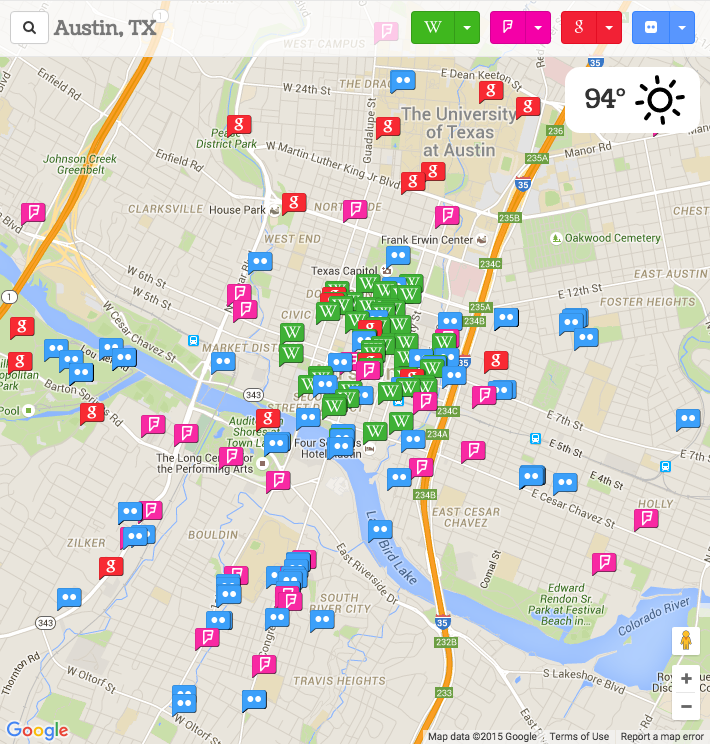

# neighborhood-map
## Project 5 for the Udacity Front End Developer Nanodegree

The interactive map pulls local data from Wikipedia, Foursquare, Flickr and Google Places. The tool bar up top controls which data sets are applied to the map, and you can view the results in a list view as well. The project is using...
* npm - for loading in modules mostly for the build system
* gulp - for running sass, minifying assets, and deploying to github pages
* bower - for loading in packages
* knockout.js - for data binding
* require.js - for splitting up the application logic and loading in js modules
* bootstrap-sass - for UI basics
* Google Maps JavaScript API
* Google Geocode API
* Google Places API
* Dark Sky Weather API
* Wikipedia API
* Foursquare API
* Flickr API

## Demo

[http://rewfergu.github.io/neighborhood-map/](http://rewfergu.github.io/neighborhood-map/)

## API keys
This project uses several APIs that require IDs in order to run. The IDs have been intentionally left out of this repo and need to be put back in order to run properly.  

## To Run

1. Clone the project
2. 'npm install' to load in the modules
3. 'cd src'
4. insert api keys
5. 'python -m SimpleHTTPServer 8000'

## gulp tasks
1. gulp watch - update css
2. gulp build - minify html/css/js
